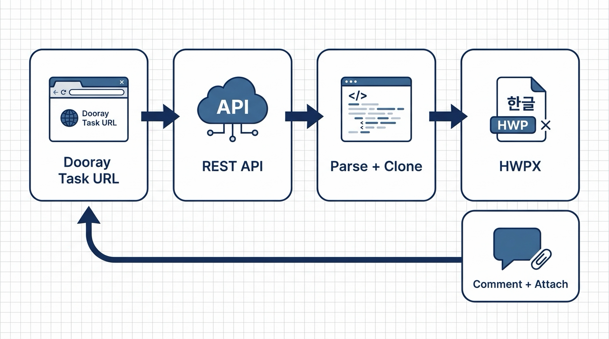

# dooray-weekly

Dooray 주간보고 업무 URL 하나로 한글(HWPX) 주요 업무 보고서를 만들고, 원본 업무에 첨부 댓글까지 등록하는 AI 에이전트 스킬.



```
Dooray 업무 URL  →  REST API 조회  →  본문 표 파싱 + 서식 노드 복제  →  HWPX  →  첨부 댓글 등록
```

## 왜 만들었나

주간보고는 Dooray 업무 본문의 표로 관리하는데, 위로 올리는 보고서는 정해진 한글 서식이다.
매주 표를 복사해 서식에 옮겨 붙이고, 담당자 표기를 다듬고, 빈 항목을 지우는 작업이 반복된다.
이 스킬은 그 왕복을 명령 한 줄로 만든다.

핵심은 **서식을 새로 그리지 않는다**는 점이다. 기준 HWPX의 문단·표 XML 노드를 그대로 복제하고
텍스트만 갈아끼우므로 글꼴, 표 테두리, 색 배너, 문단 스타일이 원본과 100% 같다.

## 기능

| 기능 | 설명 |
| --- | --- |
| 업무 조회 | 프로젝트/업무 목록, 본문, 댓글을 Dooray REST API로 조회 |
| 본문 정리 | HTML 표가 섞인 원본 마크다운을 읽을 수 있는 마크다운으로 변환 |
| 구조 파싱 | 본문 표를 `섹션 → 업무 → 세부업무` 트리로 분해 (`..` 연속행 승계 포함) |
| HWPX 생성 | 기준 서식의 노드를 복제해 보고서 생성, 표 행 높이 재계산 |
| 검수 | `fix_namespaces` → `finalize_hwpx` → `validate` 자동 실행 |
| 업로드 | 생성물을 원본 업무에 업로드하고 첨부 댓글 등록 |
| 중간 개입 | `--dump-json`으로 뽑아 고친 뒤 `--from-json`으로 재생성 |

## 필요사항

| 항목 | 내용 |
| --- | --- |
| Python | 3.10+ |
| 조회·업로드 | 표준 라이브러리만 사용 (의존성 없음) |
| HWPX 생성 | `lxml` |
| HWPX 검수 | [jkf87/hwpx-skill](https://github.com/jkf87/hwpx-skill) |
| 인증 | Dooray 개인 API 토큰 |

```bash
pip install lxml
git clone https://github.com/jkf87/hwpx-skill.git ~/.gjc/agent/skills/hwpx
```

### 환경변수

| 변수 | 기본값 | 설명 |
| --- | --- | --- |
| `DOORAY_API_KEY` | (필수) | Dooray → 설정 → API 에서 발급 |
| `DOORAY_API_HOST` | `api.gov-dooray.com` | 일반 테넌트는 `api.dooray.com` |
| `DOORAY_FILE_HOST` | `file-api.gov-dooray.com` | 첨부 업로드 전용 호스트 |
| `DOORAY_WEEKLY_PROJECT` | `주간보고` | 기본 프로젝트 code |
| `HWPX_SKILL_DIR` | `~/.gjc/agent/skills/hwpx` | hwpx-skill 경로 |
| `WEEKLY_HWPX_TEMPLATE` | — | 기준 서식 hwpx 경로 |

## 설치

에이전트 스킬 디렉토리에 그대로 넣는다.

```bash
# GJC
git clone https://github.com/jehyunlee/dooray-weekly.git ~/.gjc/agent/skills/dooray-weekly

# Claude Code
git clone https://github.com/jehyunlee/dooray-weekly.git ~/.claude/skills/dooray-weekly
```

스크립트만 단독으로 써도 된다.

## 사용법

```bash
S=~/.gjc/agent/skills/dooray-weekly/scripts
```

### 읽기

```bash
python3 $S/dooray_weekly.py show                    # 최신 주간보고 → 정리된 마크다운
python3 $S/dooray_weekly.py show <URL|id|'#2'>      # 특정 게시글
python3 $S/dooray_weekly.py show --format raw       # 원본 본문
python3 $S/dooray_weekly.py show --format json      # 전체 JSON
python3 $S/dooray_weekly.py list                    # 게시글 목록
python3 $S/dooray_weekly.py projects --query 주간   # 프로젝트 탐색
```

### HWPX 생성

```bash
python3 $S/weekly_hwpx.py                                       # 최신 → 260818_○○실 주요 업무 보고.hwpx
python3 $S/weekly_hwpx.py --post <URL> --output 보고.hwpx
python3 $S/weekly_hwpx.py --template 우리서식.hwpx
python3 $S/weekly_hwpx.py --exclude-section 기타 --keep-empty
python3 $S/weekly_hwpx.py --title "○○실 주요 업무 보고" --org ○○실 --date 2026-08-18
```

기본 제목·부서는 `--title` / `--org` 로 바꾼다. 출력 파일명 기본값은 `{YYMMDD}_{제목}.hwpx` 이고,
기준 서식은 `--template` → `$WEEKLY_HWPX_TEMPLATE` → `./template/*.hwpx` → `assets/weekly-template.hwpx`
순으로 찾는다.

### 생성 + Dooray 첨부

```bash
python3 $S/weekly_hwpx.py --post <URL> --attach --comment "초안 첨부합니다."
```

### 내용 검토 후 재생성

```bash
python3 $S/weekly_hwpx.py --dump-json parsed.json   # 구조를 JSON으로
$EDITOR parsed.json                                  # 손으로 다듬고
python3 $S/weekly_hwpx.py --from-json parsed.json --attach
```

## 스킬 발동

`SKILL.md` 프론트매터의 `description` 과 `use_when` 이 에이전트의 스킬 탐색에 걸린다.
"두레이 주간보고 작성해줘", "주간보고 만들어줘", "주간보고 읽어줘" 같은 한국어 요청이
모두 매칭되도록 트리거 문구를 나열해 두었다.

```yaml
use_when:
  - 두레이 주간보고 작성해줘
  - 주간보고 만들어줘
  - 주간보고 읽어줘
  - dooray weekly report write generate hwpx attach
```

탐색 매칭은 질의의 **모든 단어**가 `name + description + use_when` 안에 있어야 성립하므로,
쓰는 말투를 그대로 한 줄씩 추가하면 된다.

에이전트가 탐색 자체를 건너뛰는 것이 문제라면, 항상 로드되는 컨텍스트 파일(`AGENTS.md`, `CLAUDE.md`)에
라우팅 규칙을 적어 두는 쪽이 확실하다.

```markdown
### 두레이 주간보고
- "주간보고 작성해줘/만들어줘" → `dooray-weekly` 스킬로 HWPX 생성
- "주간보고 읽어줘" → 본문 조회
- "주간보고 올려줘" → 생성 후 첨부 댓글 등록
```

## 문서 구조

```
[제목 배너 표]  ○○실 주요 업무 보고
(`26.8.18.(화), ○○실)
[섹션 바 표] 1 | 분야명
  1. {업무}
  □ {세부업무} (*담당자)
  [2열 표] 주요 경과 | 향후 계획
```

### 열 매핑

| Dooray 본문 | HWPX |
| --- | --- |
| `## N. {제목}` 헤딩 | 섹션 바 (번호 1부터 재부여) |
| `업무` 열 | `N. {업무}` 문단, 연속 행은 하나로 묶음 |
| `세부업무` 열 | `□ {세부업무}` 문단, 열이 없으면 생략 |
| `담당자` 열 | `□` 줄 끝의 `(*이름)` |
| `주요 경과` (없으면 `진행사항`) | 2열 표 좌측 |
| `향후 계획` (없으면 `비고`) | 2열 표 우측 |

셀 마크다운은 1단계 불릿 → `ㅇ `, 2단계 이상 → ` - `, `[x]` → 문장 끝 ` (완료)`로 변환한다.
주요 경과와 향후 계획이 모두 빈 항목은 기본 제외하고(`--keep-empty`로 유지),
항목이 전부 빠진 업무·섹션도 사라진다.

## 기준 서식 교체

`assets/weekly-template.hwpx`는 실제 내용을 뺀 샘플이다. 조직 서식으로 바꾸려면 아래 노드가
들어있는 HWPX를 준비해 `--template`으로 넘긴다. 생성기는 내용이 아니라 **모양으로** 노드를 찾는다.

| 프로토타입 | 탐지 조건 |
| --- | --- |
| 제목 배너 | 첫 문단의 표 |
| 날짜 줄 | 두 번째 문단 |
| 섹션 바 | `colCnt=3` 인 표 |
| 업무 줄 | `숫자.` 로 시작하는 문단 |
| 세부업무 줄 | `□` 로 시작하고 run 3개 이상인 문단 |
| 경과·계획 표 | `colCnt=2` 이고 머리행에 `경과` 가 있는 표 |

생성물 자체가 이 조건을 모두 만족하므로, 만들어진 보고서를 다음 주 서식으로 다시 쓸 수 있다.

## Dooray API 메모

| 동작 | 경로 |
| --- | --- |
| 프로젝트 목록 | `GET /project/v1/projects?member=me&state=active` |
| 게시글 목록 | `GET /project/v1/projects/{projectId}/posts?order=-postUpdatedAt&postWorkflowClasses=registered,working,closed` |
| 게시글 단건 | `GET /project/v1/projects/{projectId}/posts/{postId}` |
| 댓글 | `GET`·`POST .../posts/{postId}/logs`, `PUT`·`DELETE .../logs/{logId}` |
| 첨부 목록·삭제 | `GET`·`DELETE .../posts/{postId}/files[/{fileId}]` |
| 첨부 업로드 | `POST https://file-api.gov-dooray.com/uploads/project/v1/projects/{projectId}/posts/{postId}/files` |

인증은 `Authorization: dooray-api <KEY>`, 응답은 `{"header": {"isSuccessful": bool, ...}, "result": ...}` 형태다.

삽질 두 개를 기록해 둔다.

- **업로드 호스트.** `api` 호스트로 POST하면 `file-api` 호스트로 307 리다이렉트된다. curl은 교차 호스트
  리다이렉트에서 `Authorization` 헤더를 버리므로 `-L`을 붙이면 401이 난다. `file-api`로 직접 POST해야 한다.
- **`fileIdList` 타입.** 문자열 배열이다. `[{"id": ...}]` 로 보내면 `Failed to read HTTP message` 400이 난다.

## 안전

- 쓰기는 `--attach` 를 명시했을 때만 일어난다. 기본은 조회 전용이다.
- 업무 본문 자체를 수정하는 API는 호출하지 않는다.
- 잘못 올렸으면 `DELETE .../logs/{logId}` 와 `DELETE .../posts/{postId}/files/{fileId}` 로 되돌린다.
- 생성물의 `Preview/PrvImage.png` 는 흰 이미지로 덮어쓴다. 기준 서식의 썸네일이 남으면 원본 내용이
  그림으로 새어나가기 때문이다.

## 라이선스

MIT
